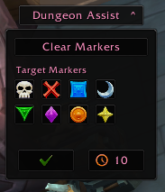

# WoW Dungeon Assist

A compact World of Warcraft party/raid control addon with a dropdown panel for marker control, ready checks, and pull countdowns.

## Features

- Collapsible `Dungeon Assist` header panel.
- Shows automatically when grouped (`party` or `raid`) with visibility modes:
  - `Group Only`
  - `Always Show`
  - `Hidden`
- Movable through Blizzard Edit Mode.
- Class-color accent styling with theme presets:
  - `QUI Dark`
  - `Slate Steel`
  - `Ember`
- Accent source options:
  - `Class Color`
  - `Custom Color` with color picker
- Accent source uses a dropdown selector.
- Configurable dropdown direction (`Down` or `Up`).
- Font uses a dropdown selector (built-in WoW fonts + LibSharedMedia fonts when available).
- Action controls:
  - `Clear Markers` clears all raid target markers.
  - Eight target marker buttons.
    - Left-click sets marker on target.
    - Right-click clears that specific marker from target (example: right-click skull clears skull).
  - Ready check icon button.
  - Countdown icon button with saved default timer value.
- Permission-aware button states:
  - Buttons dim/disable when not allowed.
  - Tooltip shows the reason (for example missing permissions or target).
- Marker announce toggle (chat message on marker set).
- Role-aware behavior:
  - Tank shortcut: optional right-click on ready button starts countdown.
  - Healer compact mode: tighter panel layout for healers.
- Mythic+ header widgets (optional, shown on the top bar):
  - Battle res status (`BR`).
  - Lust lockout status (`Lust Used` / `Lust Ready`).
- Keybinding support through `Bindings.xml`.
- Saved settings/profile-lite in `WoWDungeonAssistDB`.

## Game Version / API Notes

- TOC Interface in this repo: `120001`.
- Version in this repo: `1.3.1`.
- Uses secure templates for protected actions:
  - `SecureHandlerStateTemplate` for visibility state driver.
  - `SecureActionButtonTemplate` for ready check/countdown/markers.
- No direct protected API calls (like `SetRaidTarget`) are made from insecure Lua paths.

## Installation

1. Download or clone:
   - [https://github.com/Phrantiks-ai/wow-dungeon-assist](https://github.com/Phrantiks-ai/wow-dungeon-assist)
2. Place addon folder at:
   - `World of Warcraft/_retail_/Interface/AddOns/WoW-Dungeon-Assist`
3. Ensure these files exist:
   - `WoW-Dungeon-Assist.toc`
   - `WoW-Dungeon-Assist.lua`
   - `Bindings.xml`
4. Enable `WoW Dungeon Assist` in the AddOns menu.
5. Run `/reload` after updates.

## Usage

- Click header to expand/collapse dropdown.
- Open Edit Mode and drag the panel to move.
- Use top `Clear Markers` to clear all markers.
- Use marker buttons for per-target set/clear.
- Use bottom icon buttons for ready check and countdown.

## Config Panel

Open with:

- `/wda config`
- `/wda options`
- Interface Options/Settings category: `WoW Dungeon Assist`

Settings available:

- `Panel Scale`
- `Panel Alpha`
- `Visibility Mode`
- `Theme Preset`
- `Accent Source`
- `Custom Accent Color`
- `Dropdown Direction`
- `Font`
- `Default Countdown`
- `Lock Mover In Edit Mode`
- `Announce Marker Sets`
- `Tank Shortcut (Ready RMB = Countdown)`
- `Healer Compact Layout`
- `Mythic+ Header Widgets`

## Slash Commands

| Command | Behavior |
| --- | --- |
| `/wda config` | Opens addon config panel. |
| `/wda options` | Alias of `/wda config`. |
| `/wda show` | Sets visibility mode to Always Show. |
| `/wda auto` | Sets visibility mode to Group Only. |
| `/wda hide` | Alias of `/wda auto`. |
| `/wda mode group` | Visibility mode: Group Only. |
| `/wda mode always` | Visibility mode: Always Show. |
| `/wda mode hidden` | Visibility mode: Hidden. |
| `/wda cd 10` | Sets default countdown seconds. |
| `/wda countdown 10` | Alias of `/wda cd 10`. |
| `/wda announce` | Toggles marker announce. |
| `/wda lock` | Toggles mover lock while in Edit Mode. |
| `/wda reset` | Resets saved panel position and forces Always Show mode. |
| `/wda where` | Prints current saved anchor position. |

## Keybindings

Open `Game Menu -> Options -> Keybindings -> WoW Dungeon Assist`.

Bindings:

- `Toggle Panel`
- `Ready Check`
- `Pull Countdown`
- `Clear Markers`

## Permissions / Protected Actions

Actions can fail if Blizzard permissions are not met. The addon now shows disabled states and tooltip reasons when this happens.

Common cases:

- Not grouped.
- No valid target for marker operations.
- Raid permission limits (not leader/assistant).

Combat notes:

- Header expand/collapse is blocked in combat lockdown.
- Secure attribute updates are queued and applied when combat ends.

## Mythic+ Widget Notes

- Lust widget is based on common lust lockout debuffs across group members.
- BR widget reads known battle-res spell charge state when available.
- Outside active Mythic+, header displays muted placeholder values.

## WoWUp / GitHub Release Setup

This repo includes tag-based release packaging for WoWUp install-from-URL compatibility.

- Workflow: `.github/workflows/release.yml`
- Trigger: tags matching `v*`
- Artifact: `WoW-Dungeon-Assist-vX.Y.Z.zip`
- Zip layout: top-level `WoW-Dungeon-Assist/` addon folder

## Development Notes

- Main addon logic: `WoW-Dungeon-Assist.lua`
- TOC: `WoW-Dungeon-Assist.toc`
- Keybind definitions: `Bindings.xml`
- Preview image: `docs/dungeon-assist-panel.png`
- Saved variable: `WoWDungeonAssistDB`

When updating for a patch:

1. Bump `## Interface` in `WoW-Dungeon-Assist.toc` if needed.
2. Re-test secure actions (ready check, countdown, marker set/clear, clear-all).
3. Tag release (`vX.Y.Z`) to publish updated zip asset.
